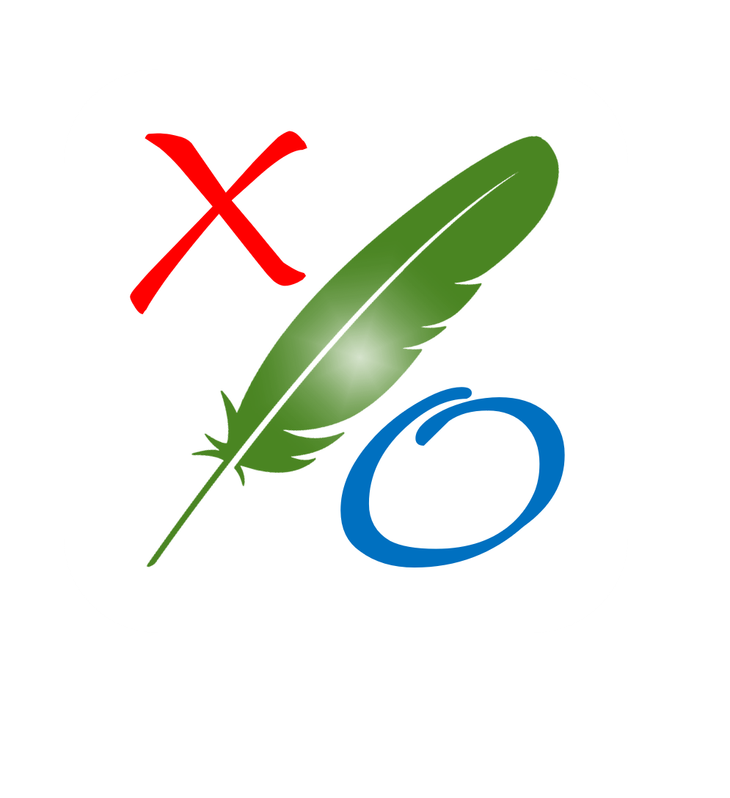



# LineXO

LeafPic is a fluid, material-designed alternative gallery, it also is ad-free and open source under GPLv3 license. It doesn't miss any of the main features of a stock gallery, and we also have plans to add more useful features. 

## Screenshot

## Usage
This project is used for academic research purposes in the Mobile application development course. Other purposes are not allowed unless approved by the authors.

## Authors
* [HUNG Nguyen Van](mailto:nvhung1401@gmail.com) *(team leader)*
* [ANH Nguyen Do Duc](mailto:anhndd1510@gmail.com)
* [SANG Nguyen Viet](mailto:nvietsang@gmail.com)
* [TRONG Le Huu](mailto:1513696@hcmut.edu.vn)

## Acknowledgments
* [MVVM Architecture](https://github.com/manas-chaudhari/android-mvvm)
* [Clean Architecture](https://blog.cleancoder.com/uncle-bob/2012/08/13/the-clean-architecture.html)
* [Data Binding](https://www.androidhive.info/android-working-with-databinding/)
* [Dagger 2](https://www.techyourchance.com/dagger-tutorial/)
* [RxJava 2](https://mindorks.com/course/learn-rxjava)
